# Genius AI — Complete Product Architecture & Evolution

This document traces the evolution of Genius AI from an initial, simple RAG implementation to a robust, production-ready, domain-agnostic RAG platform featuring dual-path routing (ChromaDB + DuckDB) and advanced document parsing (IBM Docling).

---

## 🏗️ Part 1: Architecture Evolution

### Version 1 (V1) — Basic Local RAG
- **Core Technology**: LlamaIndex + Chainlit
- **LLM/Embeddings**: Hardcoded local Ollama (`llama3` / `nomic-embed-text`)
- **Ingestion**: `SimpleDirectoryReader` into a basic in-memory or flat-file vector store.
- **Limitations**:
  - State loss on refresh.
  - Terrible performance for structured data (Excel/CSV as text).
  - Unstructured PDFs lost tables and complex formatting.
  - Hardcoded to a specific LLM and domain.

### Version 2 (V2) — Dual-Path & Stateful RAG
- **Persistence Layer**: SQLite (`data_layer.py`) introduced for user authentication, chat thread tracking, metrics, and user feedback.
- **Dual-Path Routing**:
  - *Vector Path*: Unstructured files (PDF, TXT) parsed via `SimpleDirectoryReader` into persistent ChromaDB.
  - *SQL Path*: Structured files (CSV, Excel) loaded as Pandas DataFrames into a persistent DuckDB instance via `NLSQLTableQueryEngine`.
- **Modularity**: Separation of concerns (`app.py`, `rag_engine.py`, `llm_factory.py`, `data_layer.py`).
- **Configuration Engine**: Introduction of YAML profiles (`app_profile.py`) enabling domain switching (e.g., General -> Insurance Claims -> Customer Support) and granular guardrails without code changes.

### Final Production Architecture (Current)
- **Advanced Document Parsing**: IBM Docling replaces `SimpleDirectoryReader` for PDFs, introducing layout analysis, table extraction, figure references, and OCR.
- **Provider Agnostic Model Factory**: `llm_factory.py` now dynamically routes both LLM and Embeddings between Local (Ollama/HuggingFace) and Enterprise (Azure OpenAI / TCS genailab) endpoints based on `.env` configuration.
- **Retrieval Upgrades**:
  - Hybrid Search (BM25 Keyword + Vector Search).
  - Contextual Query Rewriting leveraging chat history.
  - Anti-hallucination forced-citation prompting.
- **Feedback Loop Integration**: CLI-based reporting tools (`feedback_report.py`) extract data from `data_layer.py` joining steps, threads, and feedback to analyze response quality.

---

## 🛠️ Part 2: How Docling Fits In

IBM Docling acts as the gateway for all PDF ingestion within the `rag_engine.py` unstructured path. It intercepts the file before standard parsing and breaks it down intelligently.

### The Pipeline:
1. **Upload**: User uploads a `.pdf` file.
2. **Classification**: `_classify_file()` routes to the unstructured pipeline.
3. **Docling Interception** (`_ingest_pdf_advanced`):
   - Rather than dumping the PDF to raw text, `DoclingReader()` parses the document layout.
   - It identifies elements: Headers, Paragraphs, Tables, Code Blocks, and Figures.
   - It runs OCR if the page is scanned.
   - Tables are converted into precise HTML/Markdown tables.
4. **Structure-Aware Chunking**: `DoclingNodeParser` breaks the document into `TextNodes` based on the document's inherent structure (e.g., chunking by section header) rather than arbitrary character counts.
5. **Metadata Enrichment**: Nodes are tagged with their specific element type (`table`, `text`, `code`) and page number.
6. **Indexing**: Nodes are deposited into ChromaDB. They are retrieved seamlessly using the same Vector/Hybrid search mechanisms.
7. **Synthesis**: When retrieved, the precise Markdown tables or code blocks are fed to the LLM, enabling it to synthesize accurate, structured answers.

---

## 🗺️ Part 3: Architecture Diagrams

### 1. High-Level Component Architecture

```mermaid
graph TD
    User["User Interface (Chainlit)"] --> App["app.py (Controller)"]
    
    App <--> Config["Profiles & Config<br>(app_profile.py, config.py, .env)"]
    App <--> DataLayer["SQLiteDataLayer<br>(Auth, Threads, Feedback)"]
    App <--> Factory["llm_factory.py<br>(Model Routing)"]
    App <--> RAG["RAGEngine<br>(rag_engine.py)"]

    Factory -.->|Switch| Models{{"Models: Local (Ollama) or<br>Enterprise (Azure OpenAI)"}}
    
    RAG --> Classifier["File Classifier"]
    
    Classifier -->|Unstructured<br>(PDF)| Docling["IBM Docling<br>(Layout, OCR, Tables)"]
    Classifier -->|Unstructured<br>(TXT, MD)| Simple["SimpleDirectoryReader"]
    Classifier -->|Structured<br>(CSV, Xlsx, JSON)| Pandas["Pandas DataFrames"]
    
    Docling --> ChromaDB[("ChromaDB<br>(Vector Store)")]
    Simple --> ChromaDB
    Pandas --> DuckDB[("DuckDB<br>(SQL Backend)")]
```

### 2. Query Routing & Retrieval Flow

```mermaid
sequenceDiagram
    participant User
    participant RAG as RAGEngine
    participant Rewrite as Query Rewriter
    participant Router as RouterQueryEngine
    participant VDB as Chroma DB + BM25<br>(Unstructured)
    participant SDB as DuckDB<br>(Structured)
    participant LLM

    User->>RAG: Asks Question ("What is the total revenue?")
    RAG->>Rewrite: Rewrite query using chat history
    Rewrite-->>RAG: Enhanced Query
    
    RAG->>Router: Process Enhanced Query
    
    rect rgb(20, 20, 30)
    Note over Router: LLMSingleSelector decides the path
    end
    
    alt Needs Document Search
        Router->>VDB: Query (Vector Similarity + BM25 Keywords)
        VDB-->>Router: Retrieved Nodes (Markdown, Tables, Context)
        Router->>LLM: Synthesize Answer + Cite Sources
        LLM-->>RAG: Formatted Answer String
    else Needs Data Analysis
        Router->>SDB: Generate DuckDB SQL Query via LLM
        SDB-->>Router: Raw SQL Result (Table rows / Aggregations)
        Router->>LLM: Synthesize user-friendly result<br>(No technical jargon)
        LLM-->>RAG: Formatted Answer String
    end
    
    RAG-->>User: Final Answer displayed in Chainlit
```



### 3. File Ingestion Pipeline

```mermaid
graph LR
    File[Uploaded File] --> Valid[Validator (Size, Type, Limits)]
    Valid --> Classify{File Type?}
    
    Classify -- ".txt, .md" --> SDR[SimpleDirectoryReader]
    Classify -- ".pdf" --> Docling[DoclingReader & Parser]
    Classify -- ".csv, .xlsx, .json" --> PD[Pandas Cleaner]
    
    SDR --> Chunk[SentenceSplitter]
    Docling --> DChunk[DoclingNodeParser<br>Structure Aware]
    
    Chunk --> VDB[(ChromaDB)]
    DChunk --> VDB
    
    PD --> TName[Table Name Sanitizer]
    TName --> DDB[(DuckDB)]
    
    VDB -.-> Router((Rebuild<br>Router))
    DDB -.-> Router
```

---

## 📖 Part 4: Complete Product Detail

### System Core Components

| Component | Responsibility | Technical Implementation |
| :--- | :--- | :--- |
| **`app.py`** | Chat lifecycle, event handling, routing. | Chainlit decorators (`@cl.on_chat_start`, `@cl.on_message`). Mounts `RAGEngine` per session. |
| **`rag_engine.py`** | Ingestion coordination, persistent storage management, query execution. | LlamaIndex routers, `ChromaDB`, `DuckDB`, `Docling`, `QueryFusionRetriever` (BM25). |
| **`data_layer.py`** | Application state, metrics, audit logs, authentication. | Async `aiosqlite`, `bcrypt` for hashing. Stores User feedback (likes/dislikes) and chat history. |
| **`llm_factory.py`** | Centralizes LLM and Embedding Model instantiation. | Abstracted Langchain Adapters for remote APIs. Exposes `get_embed_model()` and `setup_global_llm()`. |
| **`app_profile.py`** & `config.py` | Environment and behavioral configuration. | YAML parsing for domain definitions, `.env` loading, global constants (Chunk sizes, Limits). |
| **`helper_scripts/`** | Administrative and maintenance tasks. | `feedback_report.py` (CLI reporting), SQL seeds, user management tools. |

### Major Capabilities

1. **Agile Domain Switching**: By changing the YAML profile in Chainlit, the application instantly morphs from a general assistant to a strict, specialized tool (e.g., Insurance Claims Adjuster) with unique system prompts and blocked topics, ensuring zero hallucination outside the domain.
2. **True Dual-Path RAG**: Automatically routes questions to the correct engine. Calculates exact numbers using SQL over large datasets while maintaining deep semantic understanding of policy manuals and unstructured text in the same conversation.
3. **High-Fidelity Document Processing**: Via IBM Docling, complex PDFs with tables, code, and nested formatting are perfectly preserved, overcoming the primary hurdle of traditional chunking methodologies.
4. **Offline / Privacy-First Capable**: By toggling `.env` parameters, the entire system (LLM, Embeddings, Parsing, Storage) runs 100% locally on commodity hardware without sending bytes to external APIs.
5. **Continuous Improvement Loop**: Deep integration of user feedback tied directly to exact conversation steps enables data-driven prompt refinement.
