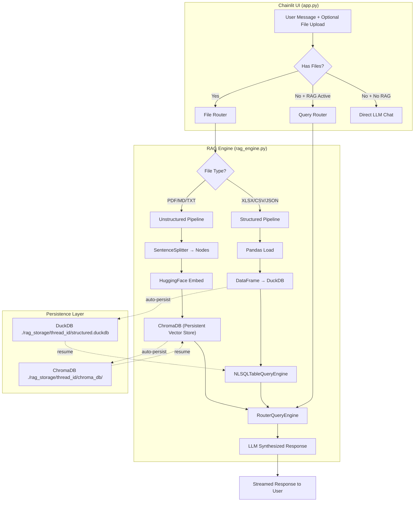

# 🧠 Genius AI — Production RAG System Master Plan

## 1. Executive Summary

Build a **dual-path RAG system** integrated into the existing Chainlit chatbot that intelligently handles both **unstructured documents** (PDF, MD, TXT → vector search via **ChromaDB**) and **structured data** (Excel, CSV, JSON → SQL engine via **DuckDB**). All RAG logic will live in a single abstraction layer (`rag_engine.py`), keeping the core `app.py` clean. The system preserves file context across chat sessions and supports seamless chat resuming.

---

## 2. Technology Choices & Rationale

Based on the requirements for performance, scalability, and developer experience, our core infrastructure choices are:

### 2.1 File Storage & Ingestion Strategy
*   **Upload Handling:** Chainlit initially saves files to `./.files/` in the project root.
*   **Persistence:** Our `rag_engine.py` will copy these files to `./rag_storage/{thread_id}/source_files/` to ensure they survive application restarts and cleanup.
*   **Incremental Ingestion:** The system is **not limited to initial vectorization**. Users can upload files dynamically at any point during a conversation. New files are automatically embedded or loaded into tables and become immediately available for querying alongside existing data.

### 2.2 Vector Database: ChromaDB
We use **ChromaDB** for unstructured document retrieval instead of SQLite or DuckDB.
*   **Why ChromaDB:** It is an AI-native database purpose-built for vector similarity search. It offers a first-class, official integration with LlamaIndex and features built-in persistence out-of-the-box (`PersistentClient`).
*   **Why not SQLite/DuckDB for vectors:** DuckDB is for analytical SQL, not vectors. SQLite (`sqlite-vec`) requires heavy manual integration with LlamaIndex.

### 2.3 SQL Database: DuckDB
We use **DuckDB** for structured data querying (Excel, CSV, JSON) instead of SQLite.
*   **Why DuckDB:** The queries users will ask about their structured data (e.g., *"What is my total revenue?", "Compare Q3 vs Q4"*) are analytical (OLAP). DuckDB is highly optimized for analytical queries, natively handles pandas DataFrames with zero-copy, and operates multi-threaded, making it 10-100x faster than SQLite for dataset analysis.
*   **Automatic Schema Inference:** Using `pandas.read_excel()`, we can directly load Excel sheets into DuckDB. DuckDB automatically infers the correct database schema (integers, strings, dates) directly from the Pandas DataFrame types.

---

## 3. LlamaIndex Capabilities Audit

We leverage the following specific components of LlamaIndex:

### 3.1 Document Ingestion & Parsers
*   `SimpleDirectoryReader`: Loads raw bytes into framework documents.
*   `SentenceSplitter`: Chunks documents into 512-token nodes with 50-token overlaps.
*   **Metadata:** Every node is tagged with `source_filename`, `upload_time`, and `thread_id`.

### 3.2 Embeddings (100% Local & Free)
*   `HuggingFaceEmbedding`: Runs embeddings locally on CPU/MPS to save costs.
*   **Model:** `BAAI/bge-small-en-v1.5` (~130MB, fast and accurate).

### 3.3 Vector Index (Unstructured Path)
*   `ChromaVectorStore`: Bridges LlamaIndex and the underlying ChromaDB instance.
*   `VectorStoreIndex`: The in-memory LlamaIndex representation built on top of the Chroma collection.

### 3.4 SQL Engine (Structured Path)
*   `SQLDatabase`: Wraps a SQLAlchemy engine connected to our DuckDB database.
*   `NLSQLTableQueryEngine`: Translates natural language questions into valid DuckDB SQL queries, executes them, and synthesizes the results.

### 3.5 Query Routing & Memory
*   `RouterQueryEngine`: Uses an LLM selector (`LLMSingleSelector`) to decide whether to route the user's question to the Vector Engine, the SQL Engine, or a normal chat sequence.
*   `ChatMemoryBuffer`: Manages conversation history size to prevent context window overflows during multi-turn RAG conversations.

---

## 4. System Architecture



---

## 5. Detailed Design Flows

### 5.1 File Upload & Processing Flow
```text
User uploads file(s) in chat
    ↓
app.py: on_message detects message.elements
    ↓
For each file:
    ├── Classify: is_structured(ext) or is_unstructured(ext)
    └── Route to rag_engine.ingest_file()
        ├── Unstructured Pipeline:
        │   ├── Copy file to rag_storage/.../source_files/
        │   ├── Parse & Chunk (SentenceSplitter)
        │   ├── Embed using BAAI/bge-small-en-v1.5
        │   └── Add nodes to ChromaVectorStore (auto-persists)
        └── Structured Pipeline:
            ├── Read via Pandas (pd.read_excel, pd.read_csv)
            ├── Clean column names (lowercase, underscores)
            └── CREATE OR REPLACE TABLE in DuckDB from DataFrame
    ↓
Rebuild RouterQueryEngine to include the newly available tools
    ↓
Return confirmation to user: "✅ Loaded 'retail_data.xlsx' (3 sheets)"
```

### 5.2 Query Flow
```text
User asks question (no file attached)
    ↓
Check: does session have RAG engines active?
    ├── No → Execute standard direct LLM chat
    └── Yes → Call rag_engine.query(question, history)
        ├── RouterQueryEngine determines intent
        │   ├── Vector Tool: Executes semantic search over ChromaDB chunks
        │   └── SQL Tool: Translates query to DuckDB SQL -> Executes -> Synthesizes
        ├── Generate combined conversational response
        └── Stream response back to Chainlit UI
```

### 5.3 Session Resumption Flow
```text
User logs in and resumes an old thread
    ↓
app.py: on_chat_resume
    ↓
Check: does `rag_storage/{thread_id}/` exist?
    ├── Re-initialize chromadb.PersistentClient against the stored directory
    ├── Re-connect duckdb to the structured.duckdb file
    ├── Rebuild the RouterQueryEngine
    └── Restore instance into cl.user_session
```

---

## 6. Engine Implementation (`rag_engine.py`)

A clean abstraction ensuring `app.py` doesn't get cluttered with LlamaIndex boilerplate.

```python
class RAGEngine:
    """Per-session RAG engine managing ChromaDB and DuckDB pipelines."""

    def __init__(self, thread_id: str, llm, embed_model=None):
        # Initializes storage paths and connects to DBs
        pass

    async def ingest_file(self, file_path: str, file_name: str) -> str:
        """Route file to correct pipeline. Returns status message."""
        pass

    async def _ingest_unstructured(self, file_path: str, file_name: str) -> str:
        """PDF/MD/TXT → ChromaDB"""
        pass

    async def _ingest_structured(self, file_path: str, file_name: str) -> str:
        """Excel/CSV/JSON → Pandas → DuckDB"""
        pass

    async def query(self, question: str, chat_history: list[dict]) -> str:
        """Route query through RouterQueryEngine."""
        pass

    @classmethod
    def load_from_storage(cls, thread_id: str, llm) -> Optional["RAGEngine"]:
        """Restore engine state from disk."""
        pass
```

---

## 7. Chainlit UI Integration (`app.py` modifications)

Modifications needed in the main application file are minimal due to encapsulation:

1.  **Dependencies:** `from rag_engine import RAGEngine`
2.  **`on_message`:** Add block to check if `message.elements` exists and pass them to `RAGEngine`.
3.  **`on_chat_resume`:** Check if a `RAGEngine` exists on disk for the thread ID and invoke `load_from_storage`.
4.  **Answer Generation:** Check if `RAGEngine` is loaded and has data; if so, call its `query()` method instead of passing it standard base context.

---

## 8. Persistence Architecture Details

All generated RAG data will cleanly exist inside a `rag_storage` folder mapped to each chat session thread.

```text
./rag_storage/
  └── {thread_id}/
      ├── chroma_db/                   # ChromaDB persistent store
      │   ├── chroma.sqlite3           # Chroma internal metadata
      │   └── ...                      # Vector files
      ├── structured.duckdb            # DuckDB SQL database (all tables)
      ├── source_files/                # Safe copies of uploaded files
      │   ├── retail_data.xlsx
      │   └── report.pdf
      └── metadata.json                # User-readable state manifest
```

---

## 9. Production Hardening & Safety

### SQL Injection Protection
Since the LLM generates SQL automatically for DuckDB, we must ensure safety.
*   **Read-Only:** Ensure `DuckDB` engines spawned for querying are executed in a safe manner, using `read_only` connection parameters where supported.
*   **Isolated Databases:** Every single chat thread gets its own isolated DuckDB file. A malicious prompt cannot drop another user's tables.

### Memory & Stability
| Risk | Mitigation |
| :--- | :--- |
| **Large PDFs** | SentenceSplitter divides memory footprint into small digestible blocks |
| **Giant Excel Sheets** | Pandas `dtype` optimizations; memory safety limits configured in config |
| **Hallucination** | System prompt instructs agent to decline if chunks/tables lack answers |

---

## 10. User Experience & Example Flow

### Uploading a Structured Dataset
```markdown
👤 **User:** [uploads retail_data.xlsx]

🤖 **Genius AI:** 
   ✅ **File Processed Successfully!**
   `retail_data.xlsx` has been loaded with 3 tables:

   - **orders**: 500 rows, 8 columns 
   - **products**: 50 rows, 5 columns
   - **customers**: 200 rows, 6 columns

   💡 *Try asking: "What are the top 3 selling products by total quantity?"*

👤 **User:** What are the top 3 selling products?

🤖 **Genius AI:** 
   According to your data, the top products are:
   1. Widget Pro (1,234 sold)
   2. Gadget X (987 sold)
   3. Tool Basic (856 sold)
   
   📝 *(Queried via DuckDB SQL)*
```

---

## 11. Configuration & Dependencies

### `pyproject.toml` Additions:
```toml
dependencies = [
    "chromadb>=1.0.0",                        # Vector Database
    "llama-index-vector-stores-chroma>=0.4.0", # LlamaIndex Integration
    "duckdb>=1.0.0",                          # Analytical SQL Database
    "duckdb-engine>=0.15.0",                  # SQLAlchemy adapter for DuckDB
    "sentence-transformers>=3.0.0",           # HuggingFace Local Embeddings
]
```

### Global Constraints:
*   **Max File Size:** `50 MB` (Handled natively by Chainlit frontend configs)
*   **Chunk Size:** `512`
*   **Chunk Overlap:** `50`
*   **Similarity Top-K:** `5`

---

## 12. Implementation Plan

```mermaid
gantt
    title Implementation Phases
    dateFormat X
    axisFormat %s

    section Phase 1: Foundation
    Create rag_engine.py skeleton          :1, 2
    Implement file routing & persistence   :2, 3

    section Phase 2: Indexing
    Implement DuckDB structured pipeline   :3, 5
    Implement ChromaDB unstructured pipe   :5, 7

    section Phase 3: Query & Chainlit
    Build RouterQueryEngine integration    :7, 8
    Modify app.py (upload & logic hooks)   :8, 10
    Implement app.py resume capabilities   :10, 11

    section Phase 4: Polish
    Error handling & edge cases           :11, 13
    Testing & Verification                :13, 14
```



---

## 13. Open Questions & Final Decisions Needed

> [!IMPORTANT]
> **1. Embedding Model Choice:** `BAAI/bge-small-en-v1.5` (~130MB) is recommended for speed/cost. We could use `BAAI/bge-base-en-v1.5` (420MB) for slightly better accuracy.
>
> **2. SQL Query Transparency:** Do you want the AI to print the generated SQL query in the chat UI for transparency, or keep it hidden unless asked?
>
> **3. File Replacement:** If a user uploads `sales.csv` and later another `sales.csv` in the same thread, should we overwrite the old one, rename it to `sales_2.csv`, or prompt the user?

---

## 14. Verification Plan

1.  **Automated Unit Tests:** Ensure file extensions route to `unstructured` vs `structured` correctly.
2.  **Persistence Test:** Upload data, shut down server, restart server, resume chat, ask a question and verify answer utilizes previously uploaded vectors.
3.  **Data Isolation:** Open two incognito browser windows, upload different files to each, verify they cannot query each other's DuckDB tables.
4.  **Fallback Test:** Upload a damaged Excel or PDF file and assert it returns a graceful error to UI instead of crashing the backend.
