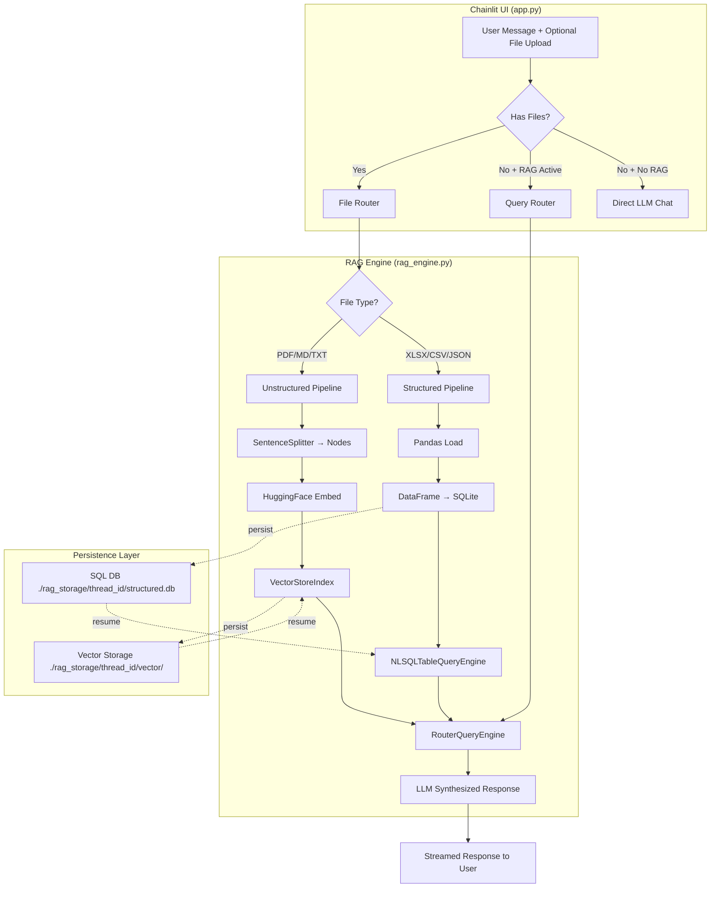

# 🧠 Genius AI — Production RAG System with LlamaIndex

## Executive Summary

Build a **dual-path RAG system** integrated into the existing Chainlit chatbot that intelligently handles both **unstructured documents** (PDF, MD, TXT → vector search) and **structured data** (Excel, CSV, JSON → SQL engine). All RAG logic lives in a single new file (`rag_engine.py`), keeping `app.py` clean. The system preserves file context within chat sessions and supports full chat resume.

---

## 1. LlamaIndex Capabilities Audit

Below is every LlamaIndex component we will leverage, mapped to our specific use case:

### 1.1 Document Ingestion & Parsing

| Component               | Purpose in Our System                                                              |
| ----------------------- | ---------------------------------------------------------------------------------- |
| `SimpleDirectoryReader` | Load PDF, MD, TXT files from temp paths after user upload                          |
| `SentenceSplitter`      | Chunk unstructured documents into 512-token nodes with 50-token overlap            |
| `Document`              | Base unit — each uploaded file becomes one or more `Document` objects              |
| Metadata injection      | Tag every node with `source_filename`, `upload_time`, `thread_id` for traceability |

### 1.2 Embedding (100% Local & Free)

| Component                       | Purpose                                                        |
| ------------------------------- | -------------------------------------------------------------- |
| `HuggingFaceEmbedding`          | Local embedding model — no API calls, no cost, runs on CPU/MPS |
| Model: `BAAI/bge-small-en-v1.5` | 384-dim, fast, excellent quality for its size (~130MB)         |
| Already in `pyproject.toml`     | `llama-index-embeddings-huggingface>=0.5.0` ✅                 |

### 1.3 Vector Index (Unstructured Path)

| Component                              | Purpose                                                         |
| -------------------------------------- | --------------------------------------------------------------- |
| `VectorStoreIndex`                     | In-memory vector store for semantic search over document chunks |
| `StorageContext`                       | Persistence layer — save/reload indexes to disk per thread      |
| `load_index_from_storage`              | Resume: reload a previously built index without re-embedding    |
| `.as_query_engine(similarity_top_k=5)` | Convert index to query engine with configurable retrieval count |

### 1.4 SQL Engine (Structured Path)

| Component                                        | Purpose                                                         |
| ------------------------------------------------ | --------------------------------------------------------------- |
| `SQLDatabase` (from `llama_index.core`)          | Wraps a SQLAlchemy engine for LlamaIndex consumption            |
| `NLSQLTableQueryEngine`                          | Natural language → SQL query → execute → synthesize answer      |
| `SQLAlchemy create_engine("sqlite:///:memory:")` | In-memory SQLite DB per session (fast, no disk I/O for queries) |
| `pandas.DataFrame.to_sql()`                      | Load Excel sheets / CSV / JSON into SQL tables automatically    |

> [!IMPORTANT]
> **Why SQL over PandasQueryEngine?** The `NLSQLTableQueryEngine` generates transparent, auditable SQL queries. The `PandasQueryEngine` generates arbitrary Python `eval()` code — a **security risk** in production. SQL is also more predictable and debuggable.

### 1.5 Query Routing

| Component           | Purpose                                                          |
| ------------------- | ---------------------------------------------------------------- |
| `RouterQueryEngine` | Combines vector + SQL engines, auto-routes based on query intent |
| `LLMSingleSelector` | LLM decides which engine handles each query                      |
| `QueryEngineTool`   | Wraps each engine with a name + description for the selector     |

### 1.6 Conversational Memory

| Component                       | Purpose                                                                    |
| ------------------------------- | -------------------------------------------------------------------------- |
| `ChatMemoryBuffer`              | Manages conversation history with token limits to prevent context overflow |
| `CondensePlusContextChatEngine` | Multi-turn RAG: condenses history → retrieves → generates                  |

### 1.7 Persistence & Resume

| Component                        | Purpose                                            |
| -------------------------------- | -------------------------------------------------- |
| `StorageContext.persist()`       | Save vector index to disk (per thread)             |
| `StorageContext.from_defaults()` | Reload persisted index on chat resume              |
| SQLite file-backed DB            | Structured data persisted as `.db` file per thread |

---

## 2. System Architecture



---

## 3. Detailed Design

### 3.1 File Upload Flow

```
User uploads file(s) in chat
    ↓
app.py: on_message detects message.elements
    ↓
For each file:
    ├── Classify: is_structured(ext) or is_unstructured(ext)
    ├── Validate: size, extension, encoding
    └── Route to rag_engine
        ├── Unstructured: ingest_document(file_path, thread_id)
        │   ├── Parse → Chunk (SentenceSplitter 512/50)
        │   ├── Embed (BAAI/bge-small-en-v1.5)
        │   ├── Add to VectorStoreIndex (create or append)
        │   └── Persist to disk
        └── Structured: ingest_structured(file_path, thread_id)
            ├── Detect format (xlsx→pd.read_excel, csv→pd.read_csv, json→pd.read_json)
            ├── For Excel: iterate all sheets → each sheet = 1 SQL table
            ├── Clean column names (lowercase, underscores, remove special chars)
            ├── Load into SQLite via df.to_sql()
            ├── Create/update NLSQLTableQueryEngine
            └── Persist DB to disk
    ↓
Build/Rebuild RouterQueryEngine with available engines
    ↓
Confirm to user: "✅ Loaded 'retail_data.xlsx' (3 sheets: orders, products, customers)"
```

### 3.2 Query Flow

```
User asks question (no file attached)
    ↓
app.py: on_message
    ↓
Check: does session have RAG engines?
    ├── No → Direct LLM chat (existing behavior, unchanged)
    └── Yes → rag_engine.query(user_question, chat_history)
        ├── RouterQueryEngine selects best engine
        │   ├── Vector engine: semantic search → top-k chunks → synthesize
        │   └── SQL engine: NL→SQL → execute → synthesize
        ├── Include conversation history for context
        └── Return synthesized response
    ↓
Stream response to user
```

### 3.3 Chat Resume Flow

```
User resumes old chat thread
    ↓
app.py: on_chat_resume
    ↓
Check: does rag_storage/{thread_id}/ exist?
    ├── Vector dir exists → load_index_from_storage()
    ├── structured.db exists → reconnect SQLite → rebuild SQL engine
    └── Both → rebuild RouterQueryEngine
    ↓
Restore into cl.user_session
    ↓
User can continue querying their previously uploaded data
```

---

## 4. File Classification & Validation

### Supported File Types

| Category         | Extensions            | Parser                                        | Destination             |
| ---------------- | --------------------- | --------------------------------------------- | ----------------------- |
| **Unstructured** | `.pdf`, `.txt`, `.md` | `SimpleDirectoryReader` + `SentenceSplitter`  | `VectorStoreIndex`      |
| **Structured**   | `.xlsx`, `.xls`       | `pd.read_excel(sheet_name=None)` → all sheets | `NLSQLTableQueryEngine` |
| **Structured**   | `.csv`                | `pd.read_csv()`                               | `NLSQLTableQueryEngine` |
| **Structured**   | `.json`               | `pd.read_json()` / `pd.json_normalize()`      | `NLSQLTableQueryEngine` |

### Validation Rules

| Rule                     | Details                                                 |
| ------------------------ | ------------------------------------------------------- |
| Max file size            | 50 MB per file (configurable)                           |
| Max files per message    | 20 (matches Chainlit config)                            |
| Encoding detection       | UTF-8 default, fallback to `chardet`                    |
| Empty file check         | Reject with user-friendly message                       |
| Corrupt file handling    | Try-catch around parsing, report specific error         |
| Excel: empty sheets      | Skip silently, warn user                                |
| CSV: delimiter detection | Auto-detect via `csv.Sniffer`                           |
| JSON: nested structures  | `pd.json_normalize()` to flatten, warn if deeply nested |

---

## 5. `rag_engine.py` — Module Design

This is the **single file** housing all RAG logic. Here's the class/function design:

```python
# rag_engine.py — Complete API Surface

class RAGEngine:
    """Per-session RAG engine managing both vector and SQL paths."""

    def __init__(self, thread_id: str, llm, embed_model=None):
        """Initialize with thread ID for persistence scoping."""

    # ── File Ingestion ────────────────────────────────────────
    async def ingest_file(self, file_path: str, file_name: str) -> str:
        """Route file to correct pipeline. Returns status message."""

    async def _ingest_unstructured(self, file_path: str, file_name: str) -> str:
        """PDF/MD/TXT → chunk → embed → VectorStoreIndex."""

    async def _ingest_structured(self, file_path: str, file_name: str) -> str:
        """Excel/CSV/JSON → DataFrame → SQLite → NLSQLTableQueryEngine."""

    # ── Querying ──────────────────────────────────────────────
    async def query(self, question: str, chat_history: list[dict]) -> str:
        """Route query through RouterQueryEngine with conversation context."""

    def has_data(self) -> bool:
        """Check if any files have been ingested in this session."""

    def get_loaded_files_summary(self) -> str:
        """Return human-readable summary of loaded files/tables."""

    # ── Persistence ───────────────────────────────────────────
    def persist(self):
        """Save all indexes and SQL DBs to disk."""

    @classmethod
    def load_from_storage(cls, thread_id: str, llm) -> Optional["RAGEngine"]:
        """Restore a RAGEngine from persisted storage (for chat resume)."""

    # ── Internal Helpers ──────────────────────────────────────
    def _rebuild_router(self):
        """Rebuild RouterQueryEngine after adding new engines."""

    def _classify_file(self, file_name: str) -> str:
        """Return 'unstructured', 'structured', or 'unsupported'."""

    def _clean_table_name(self, name: str) -> str:
        """Sanitize sheet/file names into valid SQL table names."""

    def _clean_dataframe(self, df: pd.DataFrame) -> pd.DataFrame:
        """Clean column names, handle NaN, standardize types."""
```

### Key Design Decisions

1. **One `RAGEngine` instance per chat session** — stored in `cl.user_session.set("rag_engine", engine)`
2. **Thread-scoped persistence** — all data saved under `./rag_storage/{thread_id}/`
3. **Incremental ingestion** — users can upload files across multiple messages; each new file is added to the existing index
4. **Router rebuilds on every new file** — ensures the selector always has up-to-date tool descriptions

---

## 6. Integration with `app.py`

### Changes to `app.py` (Minimal)

The existing `app.py` stays largely intact. We add:

1. **Import** `RAGEngine` from `rag_engine.py`
2. **Modify `on_message`** — detect file uploads, delegate to `RAGEngine`
3. **Modify `on_chat_resume`** — attempt to restore `RAGEngine` from disk
4. **Modify `generate_answer`** — if RAG is active, use `rag_engine.query()` instead of direct LLM
5. **Update system prompt** — include RAG context when files are loaded

### Updated Message Handler (Pseudocode)

```python
@cl.on_message
async def on_message(message: cl.Message):
    rag_engine = cl.user_session.get("rag_engine")

    # Handle file uploads
    if message.elements:
        if rag_engine is None:
            rag_engine = RAGEngine(
                thread_id=cl.context.session.thread_id,
                llm=cl.user_session.get("llm"),
            )
            cl.user_session.set("rag_engine", rag_engine)

        for element in message.elements:
            if hasattr(element, 'path') and element.path:
                status_msg = await rag_engine.ingest_file(element.path, element.name)
                await cl.Message(content=status_msg).send()

    # Handle query
    if message.content.strip():
        if rag_engine and rag_engine.has_data():
            await generate_rag_answer(message.content)
        else:
            await generate_answer(message.content)
```

---

## 7. Production Hardening & Error Handling

### 7.1 SQL Injection Prevention

```python
# NLSQLTableQueryEngine runs on a READ-ONLY connection
engine = create_engine("sqlite:///path/to/db.sqlite")

# Execute with read-only pragmas
with engine.connect() as conn:
    conn.execute(text("PRAGMA query_only = ON"))
```

> [!WARNING]
> The `NLSQLTableQueryEngine` generates SQL dynamically via the LLM. We mitigate risks by:
>
> - Using an isolated, per-session SQLite database (no shared data)
> - Setting SQLite to `query_only` mode (blocks INSERT/UPDATE/DELETE)
> - Operating on copies of uploaded data (original files unmodified)

### 7.2 Memory Management

| Concern                   | Mitigation                                                     |
| ------------------------- | -------------------------------------------------------------- |
| Large PDF files           | Chunk with `SentenceSplitter` (512 tokens), process in batches |
| Large Excel files         | Load with `dtype` optimization, drop fully null columns        |
| Many files in one session | Cap at configurable limit (default: 20 files)                  |
| Embedding model memory    | `BAAI/bge-small-en-v1.5` uses ~130MB — lightweight             |
| In-memory SQLite          | For files >100MB, use file-backed SQLite instead               |

### 7.3 Error Handling Matrix

| Error Scenario                 | Handling Strategy                                              |
| ------------------------------ | -------------------------------------------------------------- |
| Corrupted PDF                  | Catch `Exception` during parse, return user-friendly error msg |
| Empty Excel sheet              | Skip sheet, warn user which sheets were empty                  |
| CSV encoding issues            | Try UTF-8 → Latin-1 → CP1252 fallback chain                    |
| LLM generates invalid SQL      | Catch `OperationalError`, retry once with error context        |
| Embedding model download fails | Cache model on first run; graceful error if unavailable        |
| File too large                 | Reject with size limit message before processing               |
| Unsupported file type          | Return clear message listing supported formats                 |
| Network timeout (Groq API)     | Already handled by `max_retries=10` on Groq client             |
| Vector index corruption        | Delete and re-index from persisted source documents            |
| Thread storage full (disk)     | Monitor disk usage; configurable max storage per thread        |

### 7.4 Logging Strategy

```python
# Structured logging throughout rag_engine.py
logger.info(f"[{thread_id}] Ingesting file: {file_name} ({file_type})")
logger.info(f"[{thread_id}] Created {len(nodes)} chunks from {file_name}")
logger.info(f"[{thread_id}] Loaded table '{table_name}' with {len(df)} rows, {len(df.columns)} cols")
logger.info(f"[{thread_id}] Router selected: {selected_engine} for query")
logger.warning(f"[{thread_id}] Empty sheet skipped: {sheet_name}")
logger.error(f"[{thread_id}] Failed to parse {file_name}: {error}")
```

---

## 8. Persistence Architecture

### Directory Structure

```
./rag_storage/
  └── {thread_id}/
      ├── vector/                    # VectorStoreIndex persistence
      │   ├── docstore.json
      │   ├── index_store.json
      │   └── vector_store.json
      ├── structured.db              # SQLite database (all tables)
      └── metadata.json              # File manifest + table schema info
```

### `metadata.json` Schema

```json
{
  "thread_id": "abc-123",
  "files": [
    {
      "name": "report.pdf",
      "type": "unstructured",
      "ingested_at": "2026-04-14T23:00:00Z",
      "chunks": 42
    },
    {
      "name": "retail_data.xlsx",
      "type": "structured",
      "ingested_at": "2026-04-14T23:01:00Z",
      "tables": ["orders", "products", "customers"],
      "total_rows": 1500
    }
  ],
  "vector_index_exists": true,
  "sql_tables": ["orders", "products", "customers"]
}
```

---

## 9. User Experience Flow

### 9.1 First-time File Upload

```
👤 User: [uploads retail_data.xlsx]

🤖 Genius AI:
   📊 **File Processed Successfully!**

   **retail_data.xlsx** has been loaded with 3 sheets:

   | Table | Rows | Columns |
   |-------|------|---------|
   | orders | 500 | 8 (order_id, customer_id, product_id, quantity, price, ...) |
   | products | 50 | 5 (product_id, name, category, price, stock) |
   | customers | 200 | 6 (customer_id, name, email, city, signup_date, ...) |

   💡 You can now ask questions like:
   - "What were the top 5 products by revenue?"
   - "How many customers signed up last month?"
   - "Show me orders from New York"
```

### 9.2 Querying Structured Data

````
👤 User: What are the top 3 selling products by total quantity?

🤖 Genius AI:
   Based on the data in your **orders** and **products** tables:

   | Rank | Product | Total Quantity Sold |
   |------|---------|-------------------|
   | 1 | Widget Pro | 1,234 |
   | 2 | Gadget X | 987 |
   | 3 | Tool Basic | 856 |

   📝 *SQL Query used:*
   ```sql
   SELECT p.name, SUM(o.quantity) as total_qty
   FROM orders o JOIN products p ON o.product_id = p.product_id
   GROUP BY p.name ORDER BY total_qty DESC LIMIT 3
````

```

### 9.3 Mixed Files + Querying

```

👤 User: [uploads company_policy.pdf] [uploads sales_q4.csv]

🤖 Genius AI:
✅ **2 files processed:**

- 📄 **company_policy.pdf** → 28 document chunks indexed for semantic search
- 📊 **sales_q4.csv** → Table `sales_q4` loaded (1,200 rows, 7 columns)

👤 User: What does the policy say about return procedures?
→ Routes to Vector Engine (semantic search on PDF)

👤 User: What was the total revenue in Q4?
→ Routes to SQL Engine (SUM query on sales_q4 table)

````

---

## 10. Proposed Changes

### [NEW] `rag_engine.py`

The single new file containing the `RAGEngine` class with all RAG logic:
- ~400-500 lines
- Zero dependency on Chainlit internals (clean separation)
- Takes `thread_id`, `llm`, and optional `embed_model` as constructor args
- All methods are async-compatible
- Full logging with thread-scoped context

---

### [MODIFY] `app.py`

| Section | Change |
|---|---|
| Imports | Add `from rag_engine import RAGEngine` |
| `on_message` | Add file upload detection + RAG delegation |
| `on_chat_resume` | Add `RAGEngine.load_from_storage()` call |
| `generate_answer` | Keep existing logic untouched for non-RAG queries |
| New function | `generate_rag_answer()` — similar to `generate_answer` but uses RAG engine |
| System prompt | Dynamically append loaded-files context when RAG is active |

---

### [MODIFY] `pyproject.toml`

Add missing dependencies:

```toml
dependencies = [
    # ... existing ...
    "llama-index-core>=0.13.3",          # May already be pulled in
    "sentence-transformers>=3.0.0",      # Required by HuggingFace embeddings
]
````

> [!NOTE]
> Most dependencies are already present (`llama-index`, `llama-index-embeddings-huggingface`, `pandas`, `openpyxl`, `sqlalchemy`). Only `sentence-transformers` may need explicit addition.

---

## 11. Configuration Constants

```python
# rag_engine.py — Top-level configuration

# Storage
RAG_STORAGE_DIR = "./rag_storage"

# Embedding
EMBED_MODEL_NAME = "BAAI/bge-small-en-v1.5"

# Chunking
CHUNK_SIZE = 512
CHUNK_OVERLAP = 50

# Retrieval
SIMILARITY_TOP_K = 5

# Limits
MAX_FILE_SIZE_MB = 50
MAX_FILES_PER_SESSION = 20
MAX_DATAFRAME_ROWS = 500_000  # Safety limit for structured files

# SQL Safety
SQL_QUERY_TIMEOUT_SECONDS = 30

# Supported Extensions
UNSTRUCTURED_EXTENSIONS = {".pdf", ".txt", ".md"}
STRUCTURED_EXTENSIONS = {".xlsx", ".xls", ".csv", ".json"}
```

---

## 12. Open Questions

> [!IMPORTANT]
> **Embedding Model Choice**: `BAAI/bge-small-en-v1.5` (384-dim, ~130MB) is recommended for speed and zero API cost. However, if you want higher accuracy and don't mind the 420MB download, we could use `BAAI/bge-base-en-v1.5` instead. Which do you prefer?

> [!IMPORTANT]
> **SQL Query Transparency**: Should we always show the generated SQL query to the user (like in the UX example above), or only when they ask? Showing it builds trust but adds visual clutter.

> [!IMPORTANT]  
> **File Replacement Behavior**: If a user uploads `sales.csv` and later uploads another `sales.csv` in the same thread, should we:
>
> - (A) Replace the old table with the new data?
> - (B) Rename to `sales_2` and keep both?
> - (C) Ask the user what they want to do?

---

## 13. Verification Plan

### Automated Tests

```bash
# 1. Unit test: File classification
python -c "from rag_engine import RAGEngine; e = RAGEngine('test', None); assert e._classify_file('data.pdf') == 'unstructured'"

# 2. Integration test: Structured ingestion
# Upload retail_data.xlsx (already in project) → verify tables created → query

# 3. Integration test: Unstructured ingestion
# Upload chainlit.md (already in project) → verify vector index → query

# 4. End-to-end: Start Chainlit and test via browser
chainlit run app.py -w
```

### Manual Verification (Browser)

| #   | Test Scenario                          | Expected Result                          |
| --- | -------------------------------------- | ---------------------------------------- |
| 1   | Upload `retail_data.xlsx`              | See table summary with all sheets        |
| 2   | Ask "total rows in orders"             | SQL engine responds with correct count   |
| 3   | Upload `chainlit.md`                   | See "X chunks indexed" confirmation      |
| 4   | Ask "what is chainlit?"                | Vector engine responds from MD content   |
| 5   | Upload both, ask structured question   | Router selects SQL engine                |
| 6   | Upload both, ask unstructured question | Router selects vector engine             |
| 7   | Close and resume chat                  | RAG context restored, queries still work |
| 8   | Upload corrupt file                    | Graceful error message, no crash         |
| 9   | Upload 50MB+ file                      | Rejection with size limit message        |
| 10  | Chat without any file uploads          | Existing direct LLM behavior (unchanged) |

---

## 14. Implementation Order

```mermaid
gantt
    title Implementation Phases
    dateFormat X
    axisFormat %s

    section Phase 1: Foundation
    Create rag_engine.py skeleton          :1, 2
    Implement file classification          :2, 3
    Implement unstructured pipeline        :3, 5

    section Phase 2: SQL Engine
    Implement structured pipeline          :5, 7
    Build RouterQueryEngine integration    :7, 8

    section Phase 3: Integration
    Modify app.py on_message              :8, 9
    Modify app.py on_chat_resume          :9, 10
    Add generate_rag_answer               :10, 11

    section Phase 4: Polish
    Persistence & resume                  :11, 12
    Error handling & edge cases           :12, 13
    Testing & verification                :13, 14
```



**Estimated effort**: ~500 lines of new code in `rag_engine.py`, ~50 lines of changes in `app.py`.
