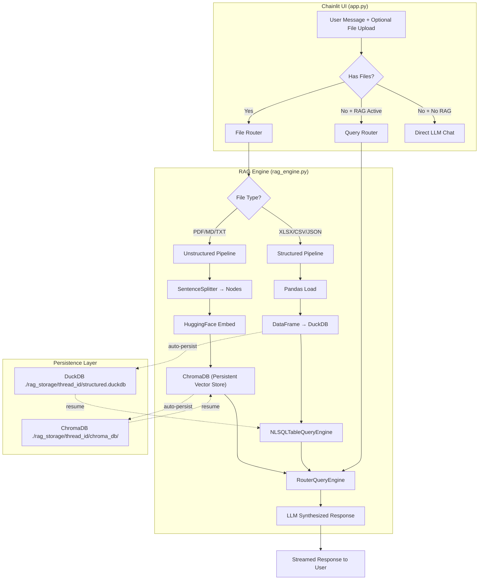

# 🧠 Genius AI — Production RAG System (Updated)

## Executive Summary

Build a **dual-path RAG system** integrated into the existing Chainlit chatbot that intelligently handles both **unstructured documents** (PDF, MD, TXT → vector search via **ChromaDB**) and **structured data** (Excel, CSV, JSON → SQL engine via **DuckDB**). All RAG logic lives in a single new file (`rag_engine.py`), keeping `app.py` clean.

---

## ❓ Your Questions — Answered

### Q1: Where do uploaded files go? Are we dependent only on initial vectorization?

> [!IMPORTANT]
> **Files ARE stored in your project folder.** You are NOT limited to initial vectorization only — users can upload new files at any time during a chat session.

**How Chainlit file uploads work:**

```
User uploads file in chat UI
        ↓
Chainlit saves it to:  ./project_root/.files/{unique_id}/{filename}
        ↓
Our code gets the path via:  element.path  (e.g., ".files/abc123/retail_data.xlsx")
        ↓
We COPY the file to our persistent storage:  ./rag_storage/{thread_id}/source_files/{filename}
        ↓
We process it (vectorize or load into SQL)
```

| Aspect               | Details                                                                                               |
| -------------------- | ----------------------------------------------------------------------------------------------------- |
| **Default location** | `.files/` directory in your project root (created automatically by Chainlit)                          |
| **Access**           | Via `element.path` attribute in the `on_message` handler                                              |
| **Config**           | Already enabled in your `.chainlit/config.toml` → `[features.spontaneous_file_upload] enabled = true` |
| **Max size**         | Currently set to 500 MB (`max_size_mb = 500`)                                                         |
| **Max files**        | 20 per message (`max_files = 20`)                                                                     |

**Our persistence strategy:**

1. **Source file copy** — We copy the uploaded file to `./rag_storage/{thread_id}/source_files/` so it survives even if `.files/` is cleaned up
2. **Processed data** — Vectors go to ChromaDB, structured data goes to DuckDB (both persistent)
3. **Dynamic uploads** — Users can upload new files at ANY point in the conversation (not just at the start). Each new file is added to the existing index/database

> [!TIP]
> **You are NOT limited to initial vectorization.** The system supports incremental ingestion — upload a PDF now, upload a CSV later, and the system combines both into a unified queryable knowledge base for that chat session.

---

### Q2: Which Vector DB? SQLite vs DuckDB vs ChromaDB?

> [!IMPORTANT]
> **Recommendation: ChromaDB** — It is purpose-built for vector search, has first-class LlamaIndex integration, and is the best fit for our RAG use case.

#### Comparison for Vector Storage

| Feature                | ChromaDB ✅                          | SQLite (`sqlite-vec`)        | DuckDB                      |
| ---------------------- | ------------------------------------ | ---------------------------- | --------------------------- |
| **Built for vectors**  | ✅ Yes, AI-native                    | ❌ Needs extension           | ❌ Not designed for this    |
| **LlamaIndex support** | ✅ First-class, official integration | ⚠️ Manual/growing            | ❌ No native vector support |
| **Setup complexity**   | `pip install chromadb` — done        | Needs `sqlite-vec` extension | Not applicable              |
| **Persistence**        | ✅ Built-in persistent mode          | ✅ File-based                | N/A                         |
| **Metadata filtering** | ✅ Native support                    | ⚠️ Via SQL WHERE             | N/A                         |
| **Similarity search**  | ✅ Optimized (cosine, L2, IP)        | ⚠️ Basic                     | N/A                         |
| **Our scale**          | ✅ Perfect (small-medium)            | ✅ Works                     | ❌ Wrong tool               |

#### Why NOT the others for vectors?

- **SQLite** (`sqlite-vec`): Would work for a "zero-dependency" approach, but LlamaIndex integration is immature. We'd spend more time fighting integration than building features.
- **DuckDB**: Designed for analytics (OLAP), not vector similarity search. It's the wrong tool entirely for embeddings.

#### How ChromaDB fits our architecture:

```python
# Instead of in-memory VectorStoreIndex, we use ChromaDB-backed storage
import chromadb
from llama_index.vector_stores.chroma import ChromaVectorStore

# Persistent ChromaDB — data survives restarts
chroma_client = chromadb.PersistentClient(path="./rag_storage/{thread_id}/chroma_db")
collection = chroma_client.get_or_create_collection("documents")
vector_store = ChromaVectorStore(chroma_collection=collection)

# LlamaIndex uses it seamlessly
index = VectorStoreIndex.from_vector_store(vector_store, embed_model=embed_model)
```

**Key benefits for us:**

1. **Persistence built-in** — no manual `StorageContext.persist()` calls; ChromaDB handles it
2. **Chat resume is trivial** — just reconnect to the same path and the vectors are there
3. **Metadata filtering** — we can filter by `source_filename`, `upload_time`, etc. natively
4. **Battle-tested** — most popular vector DB for RAG applications

---

### Q3: Which SQL DB? And will it convert Excel to SQL?

> [!IMPORTANT]
> **Recommendation: DuckDB** — It is specifically designed for analytical queries on structured data, has native pandas integration, is multi-threaded, and works seamlessly with LlamaIndex's `NLSQLTableQueryEngine`.

#### Comparison for Structured Data (SQL)

| Feature                       | DuckDB ✅                                     | SQLite                                   |
| ----------------------------- | --------------------------------------------- | ---------------------------------------- |
| **Designed for**              | Analytics (OLAP) — aggregations, joins, scans | Transactions (OLTP) — inserts, updates   |
| **Query speed on data files** | ⚡ 10-100x faster for analytics               | 🐌 Row-by-row processing                 |
| **Pandas integration**        | ✅ Native, zero-copy DataFrames               | ⚠️ Requires import/export via `to_sql()` |
| **Multi-threading**           | ✅ Uses all CPU cores                         | ❌ Single-threaded                       |
| **Direct file query**         | ✅ Can query CSV/Parquet/Excel directly       | ❌ Must import first                     |
| **LlamaIndex support**        | ✅ Via SQLAlchemy + `duckdb-engine`           | ✅ Native SQLAlchemy                     |
| **Persistence**               | ✅ File-based (`.duckdb`)                     | ✅ File-based (`.db`)                    |
| **Reliability**               | ✅ Production-ready, ACID compliant           | ✅ 25+ year track record                 |
| **Safety (read-only)**        | ✅ `access_mode='read_only'`                  | ✅ `PRAGMA query_only`                   |

#### Why DuckDB wins for OUR use case:

Our users will ask analytical questions like:

- _"What were the top 5 products by revenue?"_
- _"Show average order value by region"_
- _"Compare Q3 vs Q4 sales"_

These are **OLAP queries** — exactly what DuckDB is built for. SQLite would work but would be noticeably slower on larger datasets and lacks the native pandas integration.

#### ✅ YES — Excel IS automatically converted to SQL tables!

Here's exactly how:

```python
import pandas as pd
import duckdb

# Step 1: Read Excel (all sheets)
sheets = pd.read_excel("retail_data.xlsx", sheet_name=None)  # dict of DataFrames

# Step 2: Connect to DuckDB
con = duckdb.connect("./rag_storage/{thread_id}/structured.duckdb")

# Step 3: Each sheet becomes a SQL table (automatic schema detection!)
for sheet_name, df in sheets.items():
    table_name = clean_table_name(sheet_name)  # "Sheet1" → "sheet1"
    con.execute(f"CREATE OR REPLACE TABLE {table_name} AS SELECT * FROM df")
    # DuckDB automatically infers column types from the DataFrame:
    #   - int64 → INTEGER
    #   - float64 → DOUBLE
    #   - object (strings) → VARCHAR
    #   - datetime64 → TIMESTAMP

# Step 4: Now users can query with natural language!
# "What's the total revenue?" → LLM generates → SELECT SUM(revenue) FROM orders
```

**Supported conversions:**

| Source File             | How It's Loaded                                             | Result                        |
| ----------------------- | ----------------------------------------------------------- | ----------------------------- |
| **Excel (.xlsx, .xls)** | `pd.read_excel(sheet_name=None)` → each sheet = 1 SQL table | Multiple tables from one file |
| **CSV (.csv)**          | `pd.read_csv()` → filename = table name                     | One table per file            |
| **JSON (.json)**        | `pd.read_json()` or `pd.json_normalize()` → flattened table | One table per file            |

> [!TIP]
> **Column types are auto-detected.** Pandas reads the Excel data and infers types (numbers, dates, strings). When loaded into DuckDB, these types are preserved exactly. No manual schema definition needed!

---

## Updated Architecture (with ChromaDB + DuckDB)



---

## Updated Persistence Architecture

```
./rag_storage/
  └── {thread_id}/
      ├── chroma_db/                   # ChromaDB persistent storage (auto-managed)
      │   ├── chroma.sqlite3           # ChromaDB's internal metadata
      │   └── ...                      # Embedding data files
      ├── structured.duckdb            # DuckDB database (all tables from Excel/CSV/JSON)
      ├── source_files/                # Copies of original uploaded files
      │   ├── retail_data.xlsx
      │   └── report.pdf
      └── metadata.json               # File manifest + table schema info
```

> [!NOTE]
> **ChromaDB uses SQLite internally** for its own metadata, but this is abstracted away — you never interact with it directly. Our **structured data** queries go through DuckDB, which is the analytical engine.

---

## Updated Dependencies (`pyproject.toml`)

```toml
dependencies = [
    # ... existing ...
    "chromadb>=1.0.0",                        # Vector database for embeddings
    "llama-index-vector-stores-chroma>=0.4.0", # LlamaIndex ↔ ChromaDB bridge
    "duckdb>=1.0.0",                          # Analytical SQL database
    "duckdb-engine>=0.15.0",                  # SQLAlchemy adapter for DuckDB
    "sentence-transformers>=3.0.0",           # Required by HuggingFace embeddings
]
```

---

## Summary of Technology Choices

| Layer             | Old Plan                                          | New Plan                                    | Why                                                                          |
| ----------------- | ------------------------------------------------- | ------------------------------------------- | ---------------------------------------------------------------------------- |
| **Vector Store**  | In-memory `VectorStoreIndex` + manual persistence | **ChromaDB** (persistent)                   | Built-in persistence, first-class LlamaIndex support, metadata filtering     |
| **SQL Database**  | SQLite (in-memory/file)                           | **DuckDB** (file-backed)                    | 10-100x faster analytics, native pandas, multi-threaded, direct file queries |
| **File Storage**  | Not addressed                                     | **`.files/` → `rag_storage/source_files/`** | Chainlit's default + our persistent copy                                     |
| **Embeddings**    | `BAAI/bge-small-en-v1.5` (local)                  | Same — unchanged                            | Still the best balance of speed/quality/cost                                 |
| **Query Routing** | `RouterQueryEngine`                               | Same — unchanged                            | Still the right abstraction                                                  |

---

## Open Questions

> [!IMPORTANT]
> **Embedding Model Choice**: `BAAI/bge-small-en-v1.5` (384-dim, ~130MB) is recommended for speed and zero API cost. However, if you want higher accuracy and don't mind the 420MB download, we could use `BAAI/bge-base-en-v1.5` instead. Which do you prefer?

> [!IMPORTANT]
> **SQL Query Transparency**: Should we always show the generated SQL query to the user (like in the UX examples), or only when they ask? Showing it builds trust but adds visual clutter.

> [!IMPORTANT]  
> **File Replacement Behavior**: If a user uploads `sales.csv` and later uploads another `sales.csv` in the same thread, should we:
>
> - (A) Replace the old table with the new data?
> - (B) Rename to `sales_2` and keep both?
> - (C) Ask the user what they want to do?

---

## Verification Plan

### Automated Tests

```bash
# 1. Unit test: File classification
python -c "from rag_engine import RAGEngine; e = RAGEngine('test', None); assert e._classify_file('data.pdf') == 'unstructured'"

# 2. Integration test: ChromaDB persistence
# Upload file → verify collection created → restart → verify data still there

# 3. Integration test: DuckDB structured ingestion
# Upload retail_data.xlsx → verify tables in DuckDB → query → verify results

# 4. End-to-end: Start Chainlit and test via browser
chainlit run app.py -w
```

### Manual Verification (Browser)

| #   | Test Scenario                          | Expected Result                                 |
| --- | -------------------------------------- | ----------------------------------------------- |
| 1   | Upload `retail_data.xlsx`              | See table summary with all sheets               |
| 2   | Ask "total rows in orders"             | DuckDB SQL engine responds with correct count   |
| 3   | Upload `chainlit.md`                   | See "X chunks indexed" in ChromaDB              |
| 4   | Ask "what is chainlit?"                | ChromaDB vector engine responds from MD content |
| 5   | Upload both, ask structured question   | Router selects SQL engine                       |
| 6   | Upload both, ask unstructured question | Router selects vector engine                    |
| 7   | Close and resume chat                  | RAG context restored from ChromaDB + DuckDB     |
| 8   | Upload corrupt file                    | Graceful error message, no crash                |
| 9   | Chat without any file uploads          | Existing direct LLM behavior (unchanged)        |
